# Aakash Vaani 🗺️🎤


<div align="center">
  
  <p>Navigate, search, and explore with the power of your voice.</p>
</div>

## ✨ Overview

**Aakash Vaani** (meaning "Voice of the Sky") is an innovative voice-controlled mapping application designed for global users. It combines speech recognition technology with interactive mapping capabilities, enabling users to navigate, search for locations, and control map layers using natural voice commands in multiple languages.

The application is built as a progressive web app (PWA), allowing offline functionality and a native-like user experience across devices.

## 🎯 Key Features

- **Voice-Powered Navigation**: Control maps with natural language voice commands
- **Multi-Language Support**: Recognize commands in multiple languages
- **Offline Capabilities**: Continue using the app without an internet connection
- **Customizable Map Layers**: Control various map visualizations through voice
- **Progressive Web App**: Install and use like a native application
- **Location-Based Services**: Find nearby points of interest
- **Geocoding**: Search for addresses and landmarks
- **Real-Time Updates**: Live traffic, weather data integration
- **Accessibility-Focused**: Designed to be usable by people with disabilities

## 📊 Project Statistics

### Codebase Summary

| Category | Files | Lines of Code | % of Codebase |
|----------|-------|---------------|---------------|
| Frontend JavaScript | 12 | 1,742 | 50.0% |
| Frontend CSS/HTML | 4 | 818 | 23.5% |
| Backend Python | 4 | 353 | 10.1% |
| Configuration | 10 | 574 | 16.4% |
| **Total** | **30** | **3,487** | **100%** |

### Component Breakdown

- **Frontend**: 2,560 lines (73.5%)
  - React Components: 1,106 lines
  - Services: 582 lines
  - Utilities: 397 lines
  - Styling: 475 lines
- **Backend**: 353 lines (10.1%)
  - API Endpoints: 200 lines
  - Data Processing: 92 lines
  - Configuration: 61 lines
- **Configuration/Other**: 574 lines (16.4%)

### Tech Stack

| Category | Technologies |
|----------|-------------|
| Frontend | React, Leaflet, Web Speech API, Service Workers, IndexedDB |
| Backend | FastAPI, Python, MongoDB |
| DevOps | Docker, Nginx, Supervisor |
| Data Sources | OpenStreetMap, Nominatim API, Weather APIs |
| ML Models | TensorFlow.js for offline speech recognition |

## 🏗️ Architecture

```mermaid
graph TD
    User[User] --> VoiceInput[Voice Input]
    VoiceInput --> SpeechProcessor[Speech Processing]
    SpeechProcessor --> CommandProcessor[Command Processor]
    CommandProcessor --> MapController[Map Controller]
    CommandProcessor --> SearchController[Search Controller]
    CommandProcessor --> LayerController[Layer Controller]
    MapController --> MapView[Map View]
    SearchController --> GeocodingService[Geocoding Service]
    GeocodingService --> ExternalAPI[External APIs]
    LayerController --> WMSService[WMS Service]
    MapView --> LeafletMap[Leaflet Map]
    ExternalAPI --> SearchResults[Search Results]
    SearchResults --> MapView
    WMSService --> MapLayers[Map Layers]
    MapLayers --> MapView
```



## 🚀 Installation and Setup

### Prerequisites

- Node.js (v16+)
- Python 3.11+
- MongoDB (optional for extended features)

### Frontend Setup

```bash
# Clone repository
git clone https://github.com/yourusername/aakash-vaani.git
cd aakash-vaani

# Install frontend dependencies
cd frontend
yarn install

# Create .env file (example)
echo "REACT_APP_BACKEND_URL=http://localhost:8001" > .env

# Start development server
yarn start
```

### Backend Setup

```bash
# Navigate to backend directory
cd ../backend

# Create virtual environment
python -m venv venv
source venv/bin/activate  # On Windows: venv\Scripts\activate

# Install dependencies
pip install -r requirements.txt

# Create .env file (example)
echo "MONGO_URL=mongodb://localhost:27017" > .env
echo "DB_NAME=aakash_vaani_db" >> .env

# Start development server
uvicorn server:app --reload --port 8001
```

### Docker Deployment

```bash
# Build and run with Docker
docker build -t aakash-vaani .
docker run -p 8080:8080 -p 8001:8001 aakash-vaani
```

## 🖥️ Usage

### Voice Commands

Aakash Vaani responds to various voice commands. Here are some examples:

| Command Type | Example Commands | Description |
|--------------|-----------------|-------------|
| Search | "Find restaurants near me" | Searches for points of interest |
| Navigate | "Take me to Central Park" | Sets a destination for navigation |
| Layers | "Show traffic layer" | Displays or hides map layers |
| Zoom | "Zoom in", "Set zoom level 15" | Controls map zoom level |
| Reset | "Reset map" | Returns to default map view |
| Help | "What can I say?" | Shows available commands |

### Map Navigation

- **Pan**: Click and drag the map
- **Zoom**: Use the +/- controls or pinch gesture
- **Select**: Click on map markers for details
- **Layers**: Use the layer control or voice commands

## 📸 Screenshots

<div align="center">
  
  
  
</div>

## 📂 Project Structure

```
aakash-vaani/
├── backend/                 # Python FastAPI backend
│   ├── external_integrations/ 
│   ├── requirements.txt     # Python dependencies
│   └── server.py            # Main server file
├── frontend/                # React frontend
│   ├── public/
│   │   ├── index.html       # HTML template
│   │   ├── manifest.json    # PWA manifest
│   │   ├── offline.html     # Offline fallback
│   │   └── service-worker.js # Service worker for offline functionality
│   ├── src/
│   │   ├── components/      # React components
│   │   ├── services/        # API services
│   │   ├── utils/           # Utility functions
│   │   ├── App.js           # Main application
│   │   └── index.js         # Entry point
│   └── package.json         # Frontend dependencies
├── scripts/                 # Utility scripts
├── .devcontainer/           # Development container config
├── Dockerfile               # Production Docker configuration
├── nginx.conf               # Nginx configuration
└── README.md                # Project documentation
```

## 🔍 Key Components

### Frontend Components

- **VoiceNavigator**: Processes speech input and converts to commands
- **MapContainer**: Handles map rendering and interaction
- **VoiceCommandLog**: Displays history of voice commands
- **VoiceStatusIndicator**: Shows current voice processing status

### Backend Services

- **GeocodingService**: Address lookup and reverse geocoding
- **POIService**: Points of interest search
- **WMSService**: Web Map Service layer management
- **ModelDownloader**: Manages offline TensorFlow.js models

## 💻 Technical Implementation

### Voice Recognition

Aakash Vaani uses the Web Speech API for voice recognition, with fallback to a lightweight TensorFlow.js model for offline recognition. Commands are processed through a pattern-matching system that identifies intent and parameters.

```javascript
// Example voice command processing
processCommand(command) {
  // Match patterns for different command types
  const searchPattern = /^(search|find|show me|look for)\s+(.+)$/i;
  const navigatePattern = /^(navigate|take me|go)\s+(?:to|towards|toward)\s+(.+)$/i;
  
  // Check each pattern and extract parameters
  let match;
  if (match = command.match(searchPattern)) {
    return {
      type: 'search',
      query: match[2],
      rawCommand: command
    };
  } else if (match = command.match(navigatePattern)) {
    return {
      type: 'navigate',
      destination: match[2],
      rawCommand: command
    };
  }
  // Additional pattern matching...
}
```

### Offline Functionality

The app implements a service worker that caches map tiles, application assets, and search results. This allows users to continue using the app even when offline.

```javascript
// Service worker cache strategy
self.addEventListener('fetch', (event) => {
  // For static assets, use cache-first strategy
  event.respondWith(
    caches.match(event.request)
      .then((response) => {
        // Cache hit - return response
        if (response) {
          return response;
        }
        
        // Not in cache - fetch from network
        return fetch(event.request)
          .then((networkResponse) => {
            // Cache the network response for future use
            if (networkResponse.status === 200) {
              const responseToCache = networkResponse.clone();
              caches.open(CACHE_NAME).then((cache) => {
                cache.put(event.request, responseToCache);
              });
            }
            return networkResponse;
          });
      })
  );
});
```

### Map Integration

The application uses Leaflet.js for map rendering, with custom controls to manage layers, markers, and user interaction.

## 🔧 Advanced Configuration

### Environment Variables

**Frontend (.env)**

```
REACT_APP_BACKEND_URL=http://localhost:8001
REACT_APP_USE_OFFLINE_MODEL=false
REACT_APP_DEFAULT_LANGUAGE=en-US
```

**Backend (.env)**

```
MONGO_URL=mongodb://localhost:27017
DB_NAME=aakash_vaani_db
MOCK_AUTH=false
```

### Performance Optimization

- Map tiles are cached for offline use
- Speech recognition models can be downloaded for offline use
- Progressive loading of map components
- WebP image format support for smaller downloads

## 🌐 Deployment

### Docker Deployment

The project includes a multi-stage Dockerfile that builds both the frontend and backend, then combines them with an Nginx server:

1. Frontend assets are built and optimized
2. Backend code is installed with dependencies
3. Nginx serves frontend assets and proxies API requests to the backend

### Manual Deployment

1. Build the frontend: `cd frontend && npm run build`
2. Set up a web server (Nginx/Apache) to serve the frontend build directory
3. Configure the web server to proxy API requests to the backend
4. Deploy the backend using a WSGI server like Gunicorn: `gunicorn -w 4 -k uvicorn.workers.UvicornWorker server:app`

## 🤝 Contributing

Contributions are welcome! Please feel free to submit a Pull Request.

1. Fork the repository
2. Create your feature branch: `git checkout -b feature/AmazingFeature`
3. Commit your changes: `git commit -m 'Add some AmazingFeature'`
4. Push to the branch: `git push origin feature/AmazingFeature`
5. Open a Pull Request

### Development Guidelines

- Follow the existing code style
- Add tests for new features
- Update documentation as needed

## 📝 License

This project is licensed under the MIT License - see the LICENSE file for details.

## 🙏 Acknowledgements

- [OpenStreetMap](https://www.openstreetmap.org/) for map data
- [Leaflet.js](https://leafletjs.com/) for map rendering
- [TensorFlow.js](https://www.tensorflow.org/js) for offline machine learning
- [FastAPI](https://fastapi.tiangolo.com/) for the backend framework
- [React](https://reactjs.org/) for the frontend framework

---

<div align="center">
  <p>Built with ❤️ by Aakash Vaani Team</p>
  <p>© 2025 Aakash Vaani</p>
</div>
